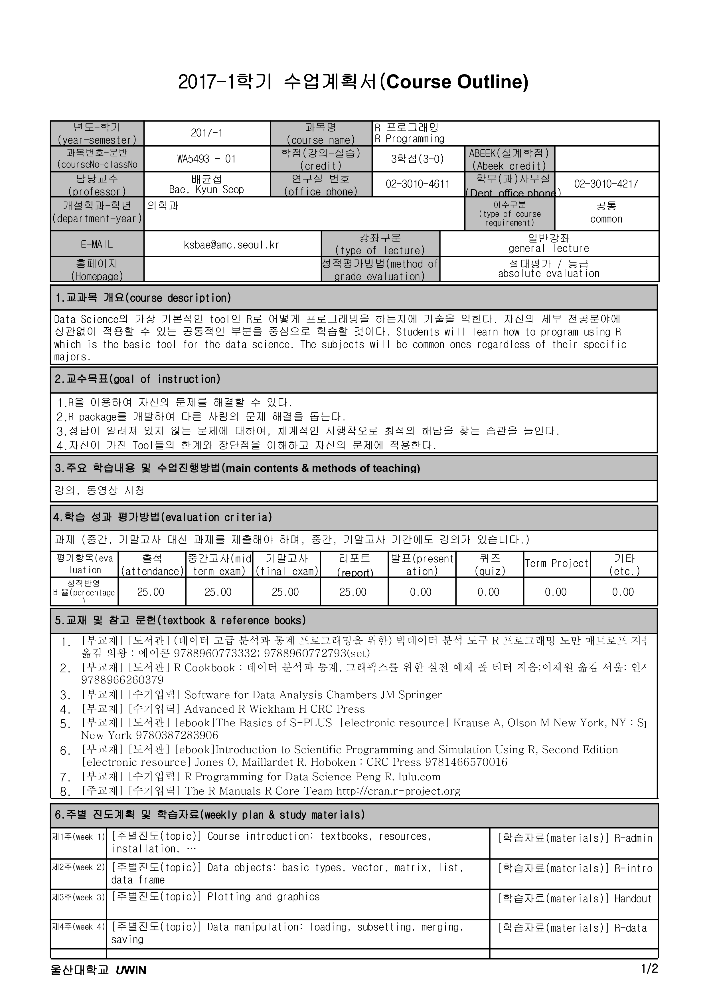
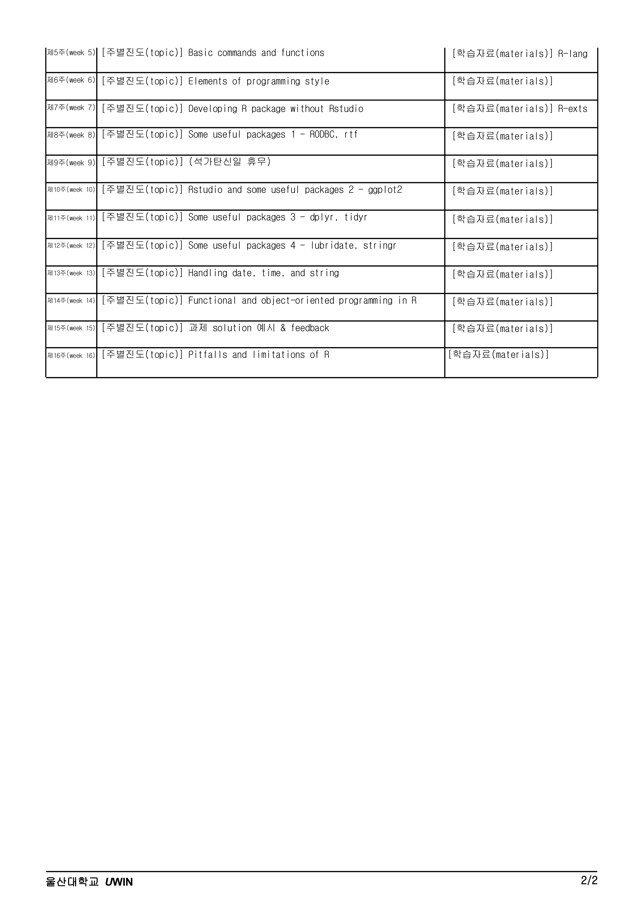

--- 
title: "R Programming - Lecture Notes"
author: "Kyun-Seop Bae, Sungpil Han"
date: "`r Sys.Date()`"
knit: "bookdown::render_book"
#documentclass: book
#papersize: A4
fontsize: 10pt
documentclass: krantz
#geometry: "margin=4in"               
#geometry: "a4paper,left=1.5in,right=1.5in,top=1in,bottom=1in"
#geometry: "a4paper, nohead, nomarginpar, left=1.5in,right=1.5in,top=5in,bottom=3in,foot=1in"
#geometry: "a4paper, nohead, nomarginpar"
#geometry: "total={6.5in,8.75in}, top=1.2in, left=0.9in, includefoot"
#geometry: "a4paper, nohead, nomarginpar, left=1.5in,right=1.5in,top=1in,bottom=1in, includeheadfoot"
monofont: "Source Code Pro"
monofontoptions: "Scale=0.7"
lot: yes
lof: yes
bibliography: [packages.bib, manual.bib]
biblio-style: apalike
link-citations: yes
colorlinks: yes
site: bookdown::bookdown_site
description: "2017년 1학기 울산대학교 의학과 대학원 수업 R Programming의 강의 노트입니다."
url: 'https\://asancpt.github.io/Rprogramming/'
github-repo: asancpt/Rprogramming
cover-image: images/cover.jpg
---

```{r setup, include=FALSE}
options(
  htmltools.dir.version = FALSE, formatR.indent = 2,
  width = 55, digits = 4, warnPartialMatchAttr = FALSE, warnPartialMatchDollar = FALSE
)

CACHE <- TRUE
# CACHE <- FALSE

knitr::opts_chunk$set(results = 'markup', cache = CACHE, 
    error = TRUE, collapse = FALSE)# , dev = c('png', 'pdf'))

myPackages <- c('knitr')
lapply(myPackages, function(pkg) {
    if (system.file(package = pkg) == '') install.packages(pkg)
})
#lapply(myPackages, library, character.only = TRUE)

library(knitr)
library(readxl)
library(dplyr)
library(zoo)
```

# Preface {-}

안녕하십니까? 

2017년 1학기 울산대학교 의학과 대학원 수업 `R Programming` 과목 담당교수 배균섭입니다. 

R은 <http://cran.r-project.org> 에서 다운로드받아 설치할 수 있습니다. 
역시 같은 사이트에서 Manual이 나와 있으니 참고하시기 바랍니다. 
구글에서 ‘R Programming pdf’와 같은 키워드로 검색하시면 많은 자료를 보실 수 있습니다.

첨부한 [R.stx](https://groups.google.com/a/acr.kr/group/r/attach/409db97bf453a/R.stx?part=0.1&authuser=0) 파일은 AcroEdit이라는 editor에서 사용할 syntax highlighting용 구문 파일입니다. 
<http://www.acrosoft.pe.kr> 에서 다운로드 받아 설치하시기 바랍니다.
AcroEdit대신 notepad++를 선호하시는 분은 그대로 사용하셔도 됩니다.

저는 RStudio, tinnR 등을 이용해서 강의하지 않습니다만, 필요하신 분은 쓰셔도 괜찮습니다. 
향후 R package 작성을 위해서는 MiKTeX와 Rtools를 설치하십시오.

추가로 말씀드리자면, <http://www.coursera.org> 에 많은 R 강좌가 개설되어 있습니다. 
Specialization course로 들어가면 유로이지만, 
(Specialization course는 여러 개의 과목이 합쳐져 있는 것입니다.) 
개별 과목을 검색해서 들어가면, 무료로도 볼 수 있습니다. 
(대신 시험을 칠 수 없거나, certificate를 받을 수 없습니다.)

좋은 강좌가 많으니 많이 활용하시기 바립니다.

강의 장소에 불편함이 많은 것으로 생각되어, 다음과 같이 Skype 모임을 개설하였습니다. 
사정상 원거리에서 오시기 불편한 분들은 활용하시기 바랍니다. 
출석은 화면을 캡쳐하거나 휴대폰으로 찍은 뒤 sec@acp.kr, shan@acp.kr로 보내주시면 출석으로 인정해 드립니다.

Skype 모임 참가 <https://meet.lync.com/uucp-acp/ksbae/SKGJ3BNQ>

2017년 3월, 배균섭 배상

```{r fig.align='center', echo=FALSE, include=identical(knitr:::pandoc_to(), 'html'), fig.link='https://asancpt.github.io/Rprogramming/', out.width = 300}
knitr::include_graphics('images/cover.jpg', dpi = NA)
```

The online version of this book is licensed under the [Creative Commons Attribution-NonCommercial-ShareAlike 4.0 International License](http://creativecommons.org/licenses/by-nc-sa/4.0/). 

  


## Teaching Assistant {-}

안녕하십니까? 서울아산병원 임상약리학과 전공의 한성필입니다. 
수업과 관련된 여러 제반 업무를 담당하고 있습니다. 
언제든 의문사항 있으면 r@acr.kr 로 전체 메일 보내시거나 교수님 k@acr.kr 혹은 제 개인 메일 shan@acp.kr로 연락해 주십시오.

교수님께서 세우신 방침에 따라 수업시간에 출석을 부르지 않을 예정입니다. 
수강하시는 화면(Skype)을 휴대폰으로 사진 찍으시거나 강의실의 스크린을 사진으로 촬영하셔서 sec@acp.kr / shan@acp.kr 로 동시에 보내주시면 됩니다. 
가급적 "2017-03-31 한성필 출석" 과 같은 식의 제목을 유지해 주시면 처리하는데 큰 도움이 될 것 같습니다.

**출석 체크를 위해 전체메일을 사용하지 말아주십시오!**

아울러 수업 중에 사용한 코드/스크립트를 사용하여 R의 패키지인 `bookdown`을 사용해 웹북을 제작 중에 있습니다. [@R-bookdown] \index{bookdown}
여러분이 읽고 있는 이 책 자체가 R 코드의 일종인 `Rmarkdown`의 결과물이라고 보시면 됩니다. 
[Github 저장소](https://github.com/asancpt/Rprogramming)가 있으니 소스 코드를 보실 수 있습니다. 
누구나 소스를 편집하여 `Pull Request`를 요청할 수 있으므로 혹시 Github를 사용하셔서 웹북의 질을 높이고자 하시는 수강생 선생님들께서는 도움을 주십시오. \index{Github}
<!-- 혹은 웹북의 각 페이지 아래쪽에 Disqus 창을 달아놓았으므로, 궁금한 점을 메모로 남겨주셔도 좋습니다. \index{disqus} -->

감사합니다.

2017년 3월, 한성필 올림

## FAQ {-}

### 접속 관련 {-}

> Q. 스카이프를 한번도 안써봐서 이참에 사용법을 배우고있는데, 수업시작시에 상대방을 어떻게 검색해서 들어가면 될지 알려주시면 감사하겠습니다.

> Q. 온라인 수강시 접속하는  스카이프 주소는 무엇인지요?

<https://meet.lync.com/uucp-acp/ksbae/SKGJ3BNQ>

Chrome 등 웹브라우저에서 위 주소를 입력하면 직접 대화방으로 연결됩니다. (검색할 필요 없습니다.) 처음 설치시에는 Add-on이 설치될 수 있습니다. MacOS Sierra, Win7, Win10에서 Chrome, Internet Explorer 등을 사용하여 테스트해 보았고 모두 잘 동작하였습니다. 대부분의 경우 Skype For Business 계정이 없을 것으로 생각되는데  따로 로그인할 필요 없습니다.

수업 시작 30분 전부터 대화방을 개설해 놓도록 하겠습니다.

<https://groups.google.com/a/acr.kr/d/msg/r/nUkrE37W2kQ/waG-FkM_BgAJ> 교수님께서 처음 보낸 메일을 참고해 주십시오.

> Q. 앞으로 수업은 지난 첫수업처럼 계속 온라인 수강이 가능한 것인가요?

네, 계속 온라인으로 가능합니다. 

> Q. 저도 웹캠을 설치하여야 하여야 하나요?

설치할 필요 없습니다. 오히려 수강자의 웹캠의 전원을 꺼두시길 권고드립니다.

> Q. 수강전 온라인 강의 테스트 해볼 수 있나요?

수업 시작 30분 전부터 대화방을 개설하여 놓도록 하겠습니다.

### 출석관련 {-}

> Q. 미국학회 참석으로 수업시간이 귀국행 비행기 기내에 있을거같아 출석이 안될것 같습니다. 방법이 있을지요?

결석 사유서를 제출해 주시면 출석 처리 하겠습니다. [대학원 홈페이지 참고 바랍니다.](http://www.medulsan.ac.kr/graduate/?mid=72&curpage=files)  이 링크로 들어가시면 가장 위에 있습니다. (`결석사유서.hwp`) 
참고로 수업 영상은 녹화하여 Youtube에 비공개 링크를 만들 예정이라서 추후에 관련 영상을 시청할 수 있을 것 같습니다.
결석사유서를 제출한다고 100% 출석이 인정되는 것은 아닙니다. 
이것이 기본적으로는 offline강의이기 때문에 강의시간에 강의실에 있든지, 또는 온라인으로 접속해 있어야 합니다. 
출석사유서를 제출하거나, 추후 동영상 시청을 해서 그 증거(사진)을 제출하는 경우에 감점을 줄여드릴 수 있습니다. 예를 들어, 결석시에는 2점 감점인데, 결석사유서를 제출하면 1점만 감점한다는지, 동영상을 보면 0.5점만 감점한다는지 하는 것입니다. 
결석 사유서 제출 시 출석 처리 원칙에 대한 설명을 드리오니, 참고하시길 바랍니다.

### 과제 관련 {-}

> Q. 과제물이 있다고 들었는데 언제 assign하게 되는지요?

과제물은 빨라야 5주차 이후에 나갑니다.

> 수업계획서가 변경되었다고하셨는데, 과정을보니 시험을 몇째주에 보는지 기재되어있지 않아서요, 성적평가에는 중간고사,기말고사,과제가 모두 적혀있는데
어떤것이 맞는 것 일까요?

중간 기말 고사는 따로 없습니다. 대신 강의를 합니다. (수업계획서 참고)

### Coursera 관련 {-}

> Q. 첫 수업 때, certification 관련 말씀을 하셨는데, 정확히 coursera 사이트에서 어떤 것을 듣고, 제출을 해야하는지 궁금합니다.
(비슷한 내용이 많아, 어떤것을 들어야하는지 헷갈립니다.) \index{Coursera}

Coursera는 꼭 어느 것을 들어야 하는 것은 아니고, R programming과 관련된 것이라면 자유로이 골라서 들으면 됩니다. 대표적인 두 가지만 들자면 다음과 같습니다.
 
- <https://www.coursera.org/learn/r-programming>
- <https://www.coursera.org/learn/r-programming-environment>

> Q. Coursera 강의를 듣고 증명서를 내면 출석을 얼마나 커버할 수 있을런지요?

Coursera는 출석 커버보다는 grade를 올려 주기 위한 것입니다. 출석은 Skype로 커버해야 합니다. 출석의 성적 반영비율은 25%이지만, 규정상 4회 이상 결석이면 성적이 나갈 수 없습니다.

## Syllabus {-}

2017년 4월 10일 개정된 수업계획서입니다.





\mainmatter


<!--chapter:end:index.Rmd-->

# R language

> 2017-03-15 배균섭 교수님 강의

[R Language Definition](https://cran.r-project.org/doc/manuals/r-release/R-lang.pdf)의 초반 내용에 대해 설명하였습니다.


<!--chapter:end:020-Rlang.Rmd-->

---
title: "Graphics"
author: "H. S. Lim"
date: '2017-03-22'
editor_options:
  chunk_output_type: inline
---

# Graphics

> 2017-03-22 임형석 교수님 강의

R을 사용해 그림 그리는 방법에 대해 알아보겠습니다.

## Introduction

R에서 상위수준 그림 함수는 그림을 생성합니다.
반면 하위수준 그림 함수는 기존의 그림에 그림을 추가합니다.

## 상위수준 그림 함수 {#upper}

### 상위수준 그림 함수의 주요 인자 (arguments)

- main : 제목
- xlab/ylab : x축 및 y축 레이블
- xlim/ylim : x축 및 y축 범위
- col : 색깔
- lty : 선 모양
- pch : 점 모양
- cex : 그림 성분의 크기
- lwd : 선 굵기
- type : 그림 타입


```{r}
dta <- read.csv("PK.csv")
head(dta)
str(dta)
```

### scatter plot

```{r}

plot(dta$TIME[dta$MDV==0], dta$DV[dta$MDV==0])

plot(dta$TIME[dta$MDV==0], dta$DV[dta$MDV==0], log="y")

plot(dta$TIME[dta$MDV==0], log(dta$DV[dta$MDV==0]))

plot(dta$TIME[dta$MDV==0], dta$DV[dta$MDV==0]
     , xlab="Time (hr)", ylab="Concentration (ng/mL)" 
     , type="o", pch=2, col=1, main="PK time-course of Drug X"
     , xlim =c(-2,218), ylim=c(0,80))

plot(dta$TIME[dta$MDV==0], dta$DV[dta$MDV==0], axes=F,
     , xlab="Time (hr)", ylab="Concentration (ng/mL)" 
     , type="o", pch=2, col=1, main="PK time-course of Drug X"
     , xlim =c(-2,218), ylim=c(0,80))
axis(1, at=seq(0, 218, 24))
axis(2)
box()
```

### Histogram

```{r}

d.demog <- read.csv("DEMOG.csv")

hist(d.demog$HT)

hist(d.demog$HT, breaks=10)
hist(d.demog$HT, nclass=10)
```

#### with density line

```{r}
hist (d.demog$HT, probability=TRUE, breaks=10)
lines(density(d.demog$HT))


hist (d.demog$HT, probability=TRUE, breaks=9, xaxt="n"
      , main="Histogram for Height", xlab="Height (cm)", ylab="Probability (%)")
axis(1, at=seq(min(d.demog$HT), max(d.demog$HT), 3))
lines(density(d.demog$HT))


hist (d.demog$HT, probability=TRUE, breaks=9, xaxt="n"
      , main="Histogram for Height", xlab="Height (cm)", ylab="Probability (%)"
      , col = "lightblue", border = "pink")
axis(1, at=seq(min(d.demog$HT), max(d.demog$HT), 3))
lines(density(d.demog$HT))

```

### Box-Whisker Plot
```{r}
boxplot(d.demog$WT)

boxplot(d.demog$WT ~ d.demog$SEX)

boxplot(split(d.demog$WT, d.demog$SEX))

boxplot(WT ~ SEX, data=d.demog)

boxplot(d.demog$WT ~ d.demog$SEX
        , names=c("Male","Female"), ylab="AGE, year", ylim=c(min(d.demog$WT)-2, max(d.demog$WT)+2)
        , col="pink")

boxplot(d.demog$WT ~ d.demog$SEX
        , names=c("Male","Female"), ylab="AGE, year", ylim=c(min(d.demog$WT)-2, max(d.demog$WT)+2)
        , col=c("lightblue", "salmon"), width=c(0.6, 1))
```

-varwidth: if varwidth is TRUE, the boxes are drawn with widths proportional 
to the square-roots of the number of observations in the groups.

```{r}
boxplot(d.demog$WT ~ d.demog$SEX
        , names=c("Male","Female"), ylab="AGE, year", ylim=c(min(d.demog$WT)-2, max(d.demog$WT)+2)
        , col=c("lightblue", "salmon")
        , varwidth=TRUE)
```

### Bar Plot

```{r}
barplot(d.demog$HT)

VADeaths

barplot(VADeaths, border = "dark blue")

barplot(VADeaths, col = rainbow(20))

barplot(VADeaths, col = heat.colors(8))

barplot(VADeaths, col = gray.colors(4))

barplot(VADeaths, col = gray.colors(4), log="x")
barplot(VADeaths, col = gray.colors(4), log="y")
barplot(VADeaths, col = gray.colors(4), log="xy")
```


### pie chart

```{r}
drug.X.market <- c(0.12, 0.29, 0.32, 0.22, 0.11, 0.28)
names(drug.X.market) <- c("South Korea","China","USA","Japan","Austria","EU")
pie(drug.X.market)
```


### matplot 함수

#### matrix와 column 사이의 그림

```{r}
pct.95 <- read.csv("pct95.csv")
matplot(pct.95[,1], pct.95[,2:ncol(pct.95)], pch=1)

matplot(pct.95[,1], pct.95[,2:ncol(pct.95)], pch=1, col=c(1,2,1), type="l", lty=1, lwd=c(1,2,1))
```


### Scatter plot matrices (pairs plots)

```{r}
pairs(d.demog)
```

#### add a loess smoother, type

```{r}
pairs(d.demog, panel = panel.smooth)

panel.cor <- function(x, y, digits=2, prefix="", cex.cor)
{
    usr <- par("usr"); on.exit(par(usr))
    par(usr = c(0, 1, 0, 1))
    r = (cor(x, y))
    txt <- format(c(r, 0.123456789), digits=digits)[1]
    txt <- paste(prefix, txt, sep="")
    if(missing(cex.cor)) cex <- 1.5
    text(0.5, 0.5, txt, cex = 1.5)
}

pairs(d.demog, lower.panel=panel.smooth, upper.panel=panel.cor) 


```

## 하위수준 그림 함수 {#lower}

- points : 점추가
- lines : 선 추가
- abline : 기준선 추가
- mtext : 텍스트 추가
- legend : 설명(legend) 추가
- polygon : polygon 추가

### 점, 선, 설명 추가 하기 {add}

```{r}
plot(pct.95$TIME, pct.95$PCT50, main="PK of Drug X"
     , type="l", xlab="Time (h)", ylab="Concentration (ng/ml)"
     , ylim=range(0,80), lty=1, col="red", lwd=2)

plot(dta$TIME[dta$MDV==0], dta$DV[dta$MDV==0], main="PK of Drug X"
     , type="n", xlab="Time (h)", ylab="Concentration (ng/ml)"
     , ylim=range(0,80))
points(dta$TIME[dta$MDV==0], dta$DV[dta$MDV==0], pch = 16, cex=0.8)
lines(dta$TIME[dta$MDV==0], dta$DV[dta$MDV==0], col="black", lwd=1)
abline(40, 0, col="red", lty=2)                               # abline(a,b): y=a+b*x
legend("topright", legend=c("Individual concentrations")
       , lty=1, col="black")
```

### polygon 함수

```{r}
plot(c(1, 10), c(1, 6), type = "n")
polygon(c(2,8,8,2), c(5,4,3,2), col="lightgreen")


plot(c(1, 9), 1:2, type = "n")
polygon(1:9, c(2,1,2,1,1,2,1,2,1),
        col = c("red", "blue"),
        border = c("green", "yellow"),
        lwd = 3, lty = c("dashed", "solid"))
```

## 그림 출력하기 {#print}

### pdf graphics devices 

```{r}
pdf("PK_of_Drug_X.pdf")

plot(dta$TIME[dta$MDV==0], dta$DV[dta$MDV==0], main="PK of Drug X"
     , type="n", xlab="Time (h)", ylab="Concentration (ng/ml)"
     , ylim=range(0,80))
points(dta$TIME[dta$MDV==0], dta$DV[dta$MDV==0], pch = 16, cex=0.8)
lines(dta$TIME[dta$MDV==0], dta$DV[dta$MDV==0], col="black", lwd=1)
abline(40, 0, col="red", lty=2)                               #abline(a,b): y=a+b*x
legend("topright", legend=c("Individual concentrations")
       , lty=1, col="black")

dev.off()
```

### PNG graphics devices

```{r}
png("PK_of_Drug_X.png")

plot(dta$TIME[dta$MDV==0], dta$DV[dta$MDV==0], main="PK of Drug X"
     , type="n", xlab="Time (h)", ylab="Concentration (ng/ml)"
     , ylim=range(0,80))
points(dta$TIME[dta$MDV==0], dta$DV[dta$MDV==0], pch = 16, cex=0.8)
lines(dta$TIME[dta$MDV==0], dta$DV[dta$MDV==0], col="black", lwd=1)
abline(40, 0, col="red", lty=2)                               #abline(a,b): y=a+b*x
legend("topright", legend=c("Individual concentrations")
       , lty=1, col="black")

dev.off()
```


<!--chapter:end:030-Graphics.Rmd-->

# Data Import / Export

> 2017-03-29 배균섭 교수님 강의

이번 시간에는 자료를 불러오고 조작을 가한 뒤 저장하는 방법에 대해 알아보겠습니다.

## Read.csv

`setwd` 명령어를 통해서 자료가 있는 작업 공간을 설정할 수 있습니다. 설정 후에서는 `dir()`을 통해 파일의 이름을 확인 할 수 있습니다. `read.csv`를 통해서 자료를 R에서 사용할 수 있게 됩니다.

```{r eval = FALSE}
setwd("D:/Rt")
dir()
mydata <- read.csv("MyData2017.csv", as.is=TRUE)
```

## Theoph 데이타

R에 기본적으로 들어있는 `Theoph` 약동학 자료에 대해 살펴보겠습니다.

```{r}
head(Theoph, n = 11)
tail(Theoph, n = 11)
```

R console에서 `?Theoph`를 타이핑 치면 좀 더 자세한 정보를 얻을 수 있습니다.

## lattice

lattice 패키지를 불러온 뒤 그림을 그려보겠습니다. [@R-lattice] \index{lattice}

```{r}
library(lattice) # trellis

xyplot(conc ~ Time | Subject, data=Theoph)

xyplot(conc ~ Time | Subject, data=Theoph, type="b")

Theoph[,"ID"] = as.numeric(as.character(Theoph[,"Subject"]))

xyplot(conc ~ Time | ID, data=Theoph, type="b")

xyplot(conc ~ Time | as.factor(ID), data=Theoph, type="b")

write.csv(Theoph, "Theoph.csv", row.names=FALSE, quote=FALSE, na="")

```

## Subseting and write.csv

자료를 편집하고, subset을 만들고 각각을 파일로 저장하는 방법에 대해 알아보겠습니다.

```{r}
IDs = sort(unique(Theoph[,"ID"])) ; IDs
nID = length(IDs) ; nID

demog = unique(Theoph[,c("ID","Wt")])
colnames(demog) = c("ID", "BWT")
write.csv(demog, "1-demog.csv", row.names=FALSE, quote=FALSE, na="")

DV = Theoph[,c("ID","Time", "conc")]
colnames(DV) = c("ID", "TIME", "DV")
write.csv(DV, "3-DV.csv", row.names=FALSE, quote=FALSE, na="")

adm = cbind(IDs, rep(0, nID), rep(320, nID))
colnames(adm) = c("ID", "TIME", "AMT")
write.csv(adm, "2-adm.csv", row.names=FALSE, quote=FALSE, na="")

demog = read.csv("1-demog.csv", as.is=TRUE)
adm = read.csv("2-adm.csv", as.is=TRUE)
dv = read.csv("3-dv.csv", as.is=TRUE)

AdmDv = merge(adm, dv, by=intersect(colnames(adm), colnames(dv)), all=TRUE)
AdmDv
```

자료를 병합(`merge`)해 보겠습니다.

```{r}
DataAll = merge(demog, AdmDv, by=c("ID"), all=TRUE)
DataAll
```


<!--chapter:end:040-Data.Rmd-->

---
output: html_document
editor_options: 
  chunk_output_type: console
---

# Frequently Used Functions

> 2017-04-05 배균섭 교수님 강의

자주 쓰는 함수 및 명령어에 대해 알아보겠습니다.

## Command

```{r code = readLines("R/Script20170405.R", encoding = "UTF-8"), eval = TRUE}
```


```{r, results = 'asis', echo = FALSE}
Freq <- read_excel("data-raw/R-Keyword-Functions-Freq-Essential.xlsx", 
    sheet = "Sheet1")
Freqlist <- bind_cols(Freq %>% select(1, 2) %>%  na.locf, Freq %>% select(-1, -2, Keyword = 3)) %>% 
    filter(!is.na(Essential)) %>% 
    mutate(Title = paste(Category, Subcategory)) %>% 
    mutate(Title = gsub("#|&", "-", Title)) %>% 
    #mutate(Keyword = gsub("\\[\\[", "\\\\[\\\\[", Keyword)) %>% 
    filter(Keyword != "[[") %>% 
    mutate(Title = factor(Title, ordered = FALSE, levels = unique(Title))) %>% 
    mutate(Comment = ifelse(is.na(Comment), "", Comment))

Freqfinal <- lapply(split(Freqlist, Freqlist[, "Title"]), 
       function(x) x %>% select(-Category, -Subcategory, -Title))
```

## The basics

```{r, echo = FALSE}
Datatableskdata <- NULL
for (i in c(1:11)) {
    knit_expanded <- paste0(#"\n\n### ", gsub("^.*- ", "", names(Freqfinal)[i]),
                            "\n\n```{r knitchunk", i,", results='asis', echo=FALSE}\n\n
                            knitr::kable(Freqfinal[[", i, "]], caption = names(Freqfinal)[",i,"], booktabs = TRUE, longtable = FALSE)\n\n
                            ```")
    Datatableskdata <- c(Datatableskdata, knit_expanded)
}
```

<!--- knit those table chunk statements --> 
`r paste(knit(text = Datatableskdata, encoding = 'UTF-8'), collapse = '\n')`

## Common data structures

```{r, echo = FALSE}
Datatableskdata <- NULL
for (i in 12:15) {
    knit_expanded <- paste0(#"\n\n### ", gsub("^.*- ", "", names(Freqfinal)[i]), "\n",
                            "\n\n```{r knitchunk", i,", results='asis', echo=FALSE}\n\n
                            knitr::kable(Freqfinal[[", i, "]], caption = names(Freqfinal)[",i,"], booktabs = TRUE, longtable = FALSE)\n\n
                            ```")
    Datatableskdata <- c(Datatableskdata, knit_expanded)
}
```

<!--- knit those table chunk statements --> 
`r paste(knit(text = Datatableskdata, encoding = 'UTF-8'), collapse = '\n')`


## Statistics

```{r, echo = FALSE}
Datatableskdata <- NULL
for (i in 16:20) {
    knit_expanded <- paste0(#"\n\n### ", gsub("^.*- ", "", names(Freqfinal)[i]), "\n",
                            "\n\n```{r knitchunk", i,", results='asis', echo=FALSE}\n\n
                            knitr::kable(Freqfinal[[", i, "]], caption = names(Freqfinal)[",i,"], booktabs = TRUE, longtable = FALSE)\n\n
                            ```")
    Datatableskdata <- c(Datatableskdata, knit_expanded)
}
```

<!--- knit those table chunk statements --> 
`r paste(knit(text = Datatableskdata, encoding = 'UTF-8'), collapse = '\n')`


## Working with R 

```{r, echo = FALSE}
Datatableskdata <- NULL
for (i in 21:23) {
    knit_expanded <- paste0(#"\n\n### ", gsub("^.*- ", "", names(Freqfinal)[i]), "\n",
                            "\n\n```{r knitchunk", i,", results='asis', echo=FALSE}\n\n
                            knitr::kable(Freqfinal[[", i, "]], caption = names(Freqfinal)[",i,"], booktabs = TRUE, longtable = FALSE)\n\n
                            ```")
    Datatableskdata <- c(Datatableskdata, knit_expanded)
}
```

<!--- knit those table chunk statements --> 
`r paste(knit(text = Datatableskdata, encoding = 'UTF-8'), collapse = '\n')`


## I/O

```{r, echo = FALSE}
Datatableskdata <- NULL
for (i in 24:26) {
    knit_expanded <- paste0(#"\n\n### ", gsub("^.*- ", "", names(Freqfinal)[i]), "\n",
                            "\n\n```{r knitchunk", i,", results='asis', echo=FALSE}\n\n
                            knitr::kable(Freqfinal[[", i, "]], caption = names(Freqfinal)[",i,"], booktabs = TRUE, longtable = FALSE)\n\n
                            ```")
    Datatableskdata <- c(Datatableskdata, knit_expanded)
}
```

<!--- knit those table chunk statements --> 
`r paste(knit(text = Datatableskdata, encoding = 'UTF-8'), collapse = '\n')`

<!--chapter:end:050-Freq.Rmd-->

# Rstudio and some useful packages 2 - ggplot2 {#ggplot2}

> 2017-05-10 한성필 전공의 강의

9주차 강의 자료입니다.

Rstudio는 R을 좀더 편리하고 풍부하게 사용하기 위한 도구로서 가장 널리 사용되고 있는 IDE입니다. <https://www.rstudio.com/products/rstudio/download> 에서 가장 최신의 Rstudio를 다운로드 받을 수 있습니다.
Windows, MacOS, Devian/Redhat Linux 중 운영체제에 맞는 것을 설치하면 됩니다.

아울러 이번 강의 에서는 ggplot2의 사용법을 예제를 통해 알아보겠습니다. [@R-ggplot2]
<https://rpubs.com/kimwoohyung/ggplot2>의 자료를 많이 참고하였습니다.
<https://rpubs.com/mccannecology/53464>도 좋은 자료입니다.


<!--chapter:end:101-shan.Rmd-->

```{r, echo = TRUE, message = FALSE}
library(ggplot2)
library(gcookbook)
library(plyr)
library(reshape2)
```

## Part1

```{r Part1}
tophit <- tophitters2001[1:25,]
tophit <- tophit[,c("name", "lg", "avg")]

# y축 이산형 그래프 
ggplot(tophit, aes(x = avg, y = name, col=lg)) + geom_point()

# 그래프 정렬하기 & 그래프 격자 없애기 & 수평선 점선으로 바꾸기
ggplot(tophit, aes(x = avg, y = reorder(name, avg))) + geom_point(size = 3) + theme_bw() + 
  theme(panel.grid.major.x = element_blank(),
        panel.grid.minor.x = element_blank(),
        panel.grid.major.y = element_line(color = "grey60", linetype = "dashed"))

```

```{r}
# x, y축 바꿔서 그치기 & 그래프 격자 없애기 & 수직선 점선으로 바꾸기 & X축 값 정의 및 회전
ggplot(tophit, aes(x = reorder(name, avg), y = avg)) + geom_point(size = 3) + theme_bw() + 
  theme(axis.text.x = element_text(angle = 60, hjust = 1),
        panel.grid.major.y = element_blank(),
        panel.grid.minor.y = element_blank(),
        panel.grid.major.x = element_line(color = "grey60", linetype = "dashed"))


# 두개 변수로 정의하여 그리기
nameorder <- tophit$name[order(tophit$lg, tophit$avg)]
tophit$name <- factor(tophit$name, levels = nameorder)

# 격자 선이 그래프의 끝에서 끝까지 횡단하지 않고, 점까지만 가도록 표현 [ geom_segment ]
ggplot(tophit, aes(x = avg, y = name)) + 
  geom_segment(aes(yend = name), xend = 0, color = "grey50") + geom_point(size = 3, aes(color = lg)) + 
  scale_color_brewer(palette = "Set1", limits = c("NL", "AL")) + theme_bw() + 
  theme(panel.grid.major.y = element_blank(), legend.position = c(1, 0.55), # 범례를 그래프 안쪽으로 옮김 
        legend.justification = c(1, 0.5))


# 그룹 별 그래프 분할 
ggplot(tophit, aes(x = avg, y = name)) + 
  geom_segment(aes(yend = name), xend = 0, color = "grey50") + geom_point(size = 5, aes(color = lg)) + 
  scale_color_brewer(palette = "Set1", limits = c("NL", "AL"), guide = FALSE) + theme_bw() + 
  theme(panel.grid.major.y = element_blank()) + facet_grid(lg ~ ., scales = "free_y", space = "free_y") 


# 그룹 별 데이터 구별
# 색상기준
ggplot(heightweight, aes(x = ageYear, y = heightIn, color = sex)) + geom_point()


# 점 모양 기준
ggplot(heightweight, aes(x = ageYear, y = heightIn, shape = sex)) + geom_point()


ggplot(heightweight, aes(x = ageYear, y = heightIn, color = sex, shape = sex)) + geom_point() +
  scale_shape_manual(values = c(1,2)) + scale_color_brewer(palette = "Set1")


ggplot(heightweight, aes(x = ageYear, y = heightIn, color = sex, shape = sex)) + geom_point() +
  scale_shape_manual(values = c(3,2)) + scale_color_brewer(palette = "Set1")


# 기준 정의에 따라 구별
hw <-heightweight
hw$weightGroup <- cut(hw$weightLb, breaks = c(-Inf, 100, Inf), labels = c("< 100", ">= 100"))

# x축이 이산형일 때 점들을 랜덤하게 조금식 이동시켜 표현 
ggplot(ChickWeight, aes(x = Time, y = weight)) + geom_point()


ggplot(ChickWeight, aes(x = Time, y = weight)) + geom_jitter() # 이동 적용


# 적합된 회귀선 추가하기
sp <- ggplot(ChickWeight, aes(x = Time, y = weight)) 
sp + geom_point(color = "blue") + stat_smooth(method = lm, se = TRUE, color = "red") 


sp + geom_jitter(color = "blue") + stat_smooth(method = lm, se = TRUE, color = "red")


#그룹 별 회귀선 추가하기
sps <- ggplot(heightweight, aes(x = ageYear, y = heightIn, color = sex)) + 
  geom_point() + scale_color_brewer(palette = "Set1")
sps + geom_smooth()


# 예측값 실제값 그래프로 표현하기 (함수)
predictvals <- function(model, xvar, yvar, xrange = NULL, sample = 100, ...){
  if(is.null(xrange)){
    if(any(class(model) %in% c("lm", "glm")))
      xrange <- range(model$model[[xvar]])
    else if(any(class(model) %in% "loess"))
      xrange <- range(model$x)
  }
  
  newdata <- data.frame(x = seq(xrange[1], xrange[2], length.out = sample))
  names(newdata) <- xvar
  newdata[[yvar]] <- predict(model, newdata = newdata, ...)
  newdata
}

modlinear <- lm(heightIn ~ ageYear, heightweight)
modloess <- loess(heightIn ~ ageYear, heightweight)

lm_predicted   <- predictvals(modlinear, "ageYear", "heightIn")
loess_predicted <- predictvals(modloess, "ageYear", "heightIn")

sp <- ggplot(heightweight, aes(x = ageYear, y = heightIn)) +
  geom_point(color = "grey40")
sp + geom_line(data = lm_predicted, color = "red", size = 0.8) +
  geom_line(data = loess_predicted, color = "blue", size = 0.8)


#산점도의 점에 라벨 붙이기
sp <- ggplot(subset(countries, Year == 2009 & healthexp > 2000),
             aes(x = healthexp, y = infmortality)) + geom_point()

# 특정 값에 특정 단어로 라벨 붙이기
sp + annotate("text", x = 4350, y = 5.4, label = "Canada") + 
  annotate("text", x = 7400, y = 6.8, label = "USA")


# 데이터 값을 라벨로 붙이기
sp + geom_text(aes(label = Name), size = 4)


# 라벨의 위치를 데이터값보다 조금 크게 설정
sp + geom_text(aes(y = infmortality + 0.1, label = Name), size = 4, vjust = 0)


sp + geom_text(aes(x = healthexp + 100, label = Name), size = 4, hjust = 0)


# 특정 값만 라벨 붙이기
cdat <- subset(countries, Year == 2009 & healthexp > 2000)
cdat$Name1 <- cdat$Name 
idx <- cdat$Name %in% c("Andorra", "France", "Canada") 
cdat$Name1[!idx] <- NA
ggplot(cdat, aes(x = healthexp, y = infmortality)) + geom_point() + geom_text(aes(y = infmortality + 0.1, label = Name1), size = 4, vjust = 0)
## Warning: Removed 24 rows containing missing values (geom_text).
```

## Part2

```{r part2}

# 거품그래프(balloon plot)
hec <- HairEyeColor[,,"Male"] + HairEyeColor[,,"Female"]
hec <- melt(hec, value.name = "count") 
ggplot(hec, aes(x = Eye, y = Hair)) + geom_point(aes(size = count), shape = 21, color = "black", fill = "cornsilk") + 
  scale_size_area(max_size = 20, guide = FALSE) + 
  geom_text(aes(y = as.numeric(Hair)-sqrt(count)/22, label = count), vjust = 1, color = "grey60", size = 4)


# 산점도 행렬 만들기
c2009 <- subset(countries, Year == 2009, select = c(Name, GDP, laborrate, healthexp, infmortality)) 
plot(c2009[,2:5])


panel.hist <- function(x, ...)
{
  usr <- par("usr"); on.exit(par(usr))
  par(usr = c(usr[1:2], 0, 1.5) )
  h <- hist(x, plot = FALSE)
  breaks <- h$breaks; nB <- length(breaks)
  y <- h$counts; y <- y/max(y)
  rect(breaks[-nB], 0, breaks[-1], y, col = "cyan", ...)
}
panel.cor <- function(x, y, digits = 2, prefix = "", cex.cor, ...)
{
  usr <- par("usr"); on.exit(par(usr))
  par(usr = c(0, 1, 0, 1))
  r <- abs(cor(x, y))
  txt <- format(c(r, 0.123456789), digits = digits)[1]
  txt <- paste0(prefix, txt)
  if(missing(cex.cor)) cex.cor <- 0.8/strwidth(txt)
  text(0.5, 0.5, txt, cex = cex.cor * r)
}
panel.lm <- function(x, y, col = par("col"), bg = NA, pch = par("pch"), cex = 1, col.smooth = "black", ...){
  points(x, y, pch = pch, col = col, bg = bg, cex = cex)
  abline(stats::lm(y ~ x), col = col.smooth, ...)
}
# 데이터에 대한 LOWESS선(평활선) 추가 
pairs(c2009[,2:5], pch = ".", upper.panel = panel.cor, diag.panel = panel.hist, lower.panel = panel.lm)


# 데이터에 대한 회귀적합선 추가 
pairs(c2009[,2:5], pch = ".", upper.panel = panel.cor, diag.panel = panel.hist, lower.panel = panel.smooth)


######################################################################################
## scatter + line plot  (geom_point/ geom_line)
######################################################################################
plot(pressure$temperature, pressure$pressure, type = "l")
points(pressure$temperature, pressure$pressure)


qplot(temperature, pressure, data = pressure, geom = c("line", "point"))


ggplot(pressure, aes(x = temperature, y = pressure)) + geom_point() + geom_line()


######################################################################################
## line plot  (geom_line)
######################################################################################
ggplot(BOD, aes(x = Time, y = demand)) + geom_line() + ylim(0, max(BOD$demand))


ggplot(BOD, aes(x = Time, y = demand)) + geom_line() + expand_limits(y = 0)


ggplot(BOD, aes(x = Time, y = demand)) + geom_line() + geom_point()


# 이산형 변수값에 따른 구분 
tg <- ddply(ToothGrowth, c("supp", "dose"), summarize, length = mean(len))
# 색상으로 구분
ggplot(tg, aes(x = dose, y = length, color = supp)) + geom_line()


ggplot(tg, aes(x = factor(dose), y = length, color = supp, group = supp)) + geom_line()


# group = supp 주의! : 이 명령문이 없으면 데이터를 어떻게 묶어서 그릴지 모름
# Line type으로 구분
ggplot(tg, aes(x = dose, y = length, linetype = supp)) + geom_line()


# 점 형태로 구분
ggplot(tg, aes(x = dose, y = length, shape = supp)) + geom_line() + geom_point(size = 4)


# 점 색상으로 구분
ggplot(tg, aes(x = dose, y = length, fill = supp)) + geom_line() + geom_point(size = 4, shape = 21)


# 두 선이 겹칠때 하나의 선을 옆으로 이동시켜 표현  
ggplot(tg, aes(x = dose, y = length, shape = supp)) + geom_line(position = position_dodge(0.1)) + 
  geom_point(position = position_dodge(0.1), size = 4)


# 선 형태 바꾸기 [ linetype ]
ggplot(tg, aes(x = dose, y = length, color = supp)) + geom_line(linetype = "dashed") +
  geom_point(shape = 22, size = 3, fill = "white")
```

## Part3

```{r part3}

# 점 형태 바꾸기 [ shape ]
#################################
pd <- position_dodge(0.2)       #
#################################

ggplot(tg, aes(x = dose, y = length, fill = supp)) + geom_line(position = pd) + 
  geom_point(shape = 21, size = 5, position = pd) + 
  scale_fill_manual(values = c("black", "white"))


# sample Data
sunspotyear <- data.frame(Year     = as.numeric(time(sunspot.year)),
                          Sunspots = as.numeric(sunspot.year))
# 음영 영역 그래프 그리기
ggplot(sunspotyear, aes(x = Year, y = Sunspots)) + geom_area()


# 음영 투명도 설정하기 [ alpha ]
ggplot(sunspotyear, aes(x = Year, y = Sunspots)) + geom_area(color = "black", fill = "blue", alpha = 0.5)


# 누적 영역 그래프 그리기
ggplot(uspopage, aes(x = Year, y = Thousands, fill = AgeGroup)) + geom_area()


# 영역색상 그라데이션 넣기
ggplot(uspopage, aes(x = Year, y = Thousands, fill = AgeGroup)) + geom_area(color = "black", size = 0.2, alpha = 0.4) + 
  scale_fill_brewer(palette = "Blues", breaks = rev(levels(uspopage$AgeGroup)))


# 데이터 순서정렬하기 & 양쪽 테두리 지우기 
ggplot(uspopage, aes(x = Year, y = Thousands, fill = AgeGroup, order = desc(AgeGroup))) + 
  geom_area(color = NA, alpha = 0.4) + scale_fill_brewer(palette = "Blues") + geom_line(position = "stack", size = 0.2)


#  비율 누적 영역 그래프 그리기
uspopage_prop <- ddply(uspopage, "Year", transform, Percent = Thousands / sum(Thousands) * 100) 
ggplot(uspopage_prop, aes(x = Year, y = Percent, fill = AgeGroup)) + geom_area(color = "black", size = 0.2, alpha = 0.4) + 
  scale_fill_brewer(palette = "Blues", breaks = rev(levels(uspopage$AgeGroup)))


# 그래프에 신뢰 영역 추가하기
clim <- subset(climate, Source == "Berkeley", select = c("Year", "Anomaly10y", "Unc10y"))
# 신뢰영역 음영으로 표현 
ggplot(clim, aes(x = Year, y = Anomaly10y)) + 
  geom_ribbon(aes(ymin = Anomaly10y - Unc10y, ymax = Anomaly10y + Unc10y), alpha = 0.2) +
  geom_line()


# 신뢰영역 점선으로 표현
ggplot(clim, aes(x = Year, y = Anomaly10y)) + 
  geom_line(aes(y = Anomaly10y - Unc10y), linetype = "dotted") +
  geom_line(aes(y = Anomaly10y + Unc10y), linetype = "dotted") +
  geom_line()


# 
######################################################################################
## barplot  (geom_bar)
######################################################################################
barplot(BOD$demand, names.arg = BOD$Time)


barplot(table(mtcars$cyl))


# x값을 숫자로 인식
# qplot(BOD$Time, BOD$demand, geom = "bar", stat = "identity")
ggplot(BOD, aes(x = Time, y = demand)) + geom_bar(stat = "identity")


# x값을 요인으로 변환
# qplot(as.factor(BOD$Time), BOD$demand, geom = "bar", stat = "identity")
ggplot(BOD, aes(x = factor(Time), y = demand)) + geom_bar(stat = "identity")


# 막대 색상 채우기/테두리 설정하기 (fill : 채우기/ colour(or color) : 테두리)
ggplot(pg_mean, aes(x = group, y = weight)) + geom_bar(stat = "identity", fill = "lightblue", colour = "black")


# 막대 묶어서 표현하기(나누어 표현하고 싶은 변수를 색상으로 지정)  
ggplot(cabbage_exp, aes(x = Date, y = Weight, fill = Cultivar)) + geom_bar(stat = "identity", position = "dodge")


# dodge : "피하다"라는 의미로 막대를 새로운 값을 기준으로 나누어 표현 
ggplot(cabbage_exp, aes(x = Date, y = Weight, fill = Cultivar)) + geom_bar(stat = "identity", position = "dodge", color = "black") + 
  scale_fill_brewer(palette = "Pastel1")

```

## Part4

```{r part4}

# 빈도수 막대 그래프 그리기 
# x가 이산형
ggplot(diamonds, aes(x = cut)) + geom_bar()


# x가 연속형
ggplot(diamonds, aes(x = carat)) + geom_bar()


# 막대 색상 넣기/ 축 이름 정의하기(reorder) 
upc <- subset(uspopchange, rank(Change) > 40)
ggplot(upc, aes(x = reorder(Abb, Change), y = Change, fill = Region)) + geom_bar(stat = "identity", color = "black") +
  scale_fill_manual(values = c("#669933", "#FFCC66")) + xlab("State")


# 양수/음수 다른 색상으로 표현 (구분 inde를 만들어 색상 변수로 지정)
csub <- subset(climate, Source == "Berkeley" & Year >= 1900 )
csub$pos <- csub$Anomaly10y >= 0
ggplot(csub, aes(x = Year, y = Anomaly10y, fill = pos)) + geom_bar(stat = "identity", position = "identity")


# 막대 그래프 테두리 두께 설정(size) / 범례 지우기(guide = FALSE)
ggplot(csub, aes(x = Year, y = Anomaly10y, fill = pos)) + geom_bar(stat = "identity", position = "identity", color = "black", size = 0.0001) + 
  scale_fill_manual(values = c("#CCEEFF", "#FFDDDD"), guide = FALSE)


# 막대 너비/ 간격 조절하기(width : 최대 너비는 1)
ggplot(pg_mean, aes(x = group, y = weight)) + geom_bar(stat = "identity", width = 0.5)


# 막대 그룹 간의 간격 조절하기 (default : 0.9) 
ggplot(cabbage_exp, aes(x = Date, y = Weight, fill = Cultivar)) + geom_bar(stat = "identity", width = 0.4, position = "dodge")


# 막대 그룹 내부간의 간격 조절 (default : 0.9)
ggplot(cabbage_exp, aes(x = Date, y = Weight, fill = Cultivar)) + geom_bar(stat = "identity", width = 0.3, position = position_dodge(0.5))


# 범례 순서 바꾸기 (reverse = TRUE) 
ggplot(cabbage_exp, aes(x = Date, y = Weight, fill = Cultivar)) + geom_bar(stat = "identity") + guides(fill = guide_legend(reverse = TRUE))


# 막대 쌓는 순서 바꾸기  
ggplot(cabbage_exp, aes(x = Date, y = Weight, fill = Cultivar, order = desc(Cultivar))) + geom_bar(stat = "identity")


# 비율 누적 막대 그래프 그리기(막대 전체가 100%가 되도록)
ce <- ddply(cabbage_exp, "Date", transform, percent_weight = Weight / sum(Weight) * 100)
ggplot(ce, aes(x = Date, y = percent_weight, fill = Cultivar)) + geom_bar(stat = "identity")


# 막대에 라벨 추가하기 [ geom_text ]
# 선 상단 [ vjust < 0 ]
ggplot(cabbage_exp, aes(x = interaction(Date, Cultivar), y = Weight)) + geom_bar(stat = "identity") + 
  geom_text(aes(label = Weight), vjust = -0.2)


# 선 하단 [ vjust > 0 ]
ggplot(cabbage_exp, aes(x = interaction(Date, Cultivar), y = Weight)) + geom_bar(stat = "identity") + 
  geom_text(aes(label = Weight), vjust = 1.5, color = "white")


# 그래프 범위 설정
# max(데이터)로 지정
ggplot(cabbage_exp, aes(x = interaction(Date, Cultivar), y = Weight)) + geom_bar(stat = "identity") +
  geom_text(aes(label = Weight), vjust = -0.2) + ylim(0, max(cabbage_exp$Weight) * 1.05)


# 막대의 상단보다 조금 높은 위치로 지정(데이터에 따라 자동 조정)
ggplot(cabbage_exp, aes(x = interaction(Date, Cultivar), y = Weight)) + geom_bar(stat = "identity") +
  geom_text(aes(y = Weight + 0.1, label = Weight)) 


# 누적 합계 그래프 그리기
ce <- arrange(cabbage_exp, Date, Cultivar)
ce <- ddply(ce, "Date", transform, label = cumsum(Weight))
# ddply(data.frame, 그룹 기준 마지막 변수)
ggplot(ce, aes(x = Date, y = Weight, fill = Cultivar)) + geom_bar(stat = "identity", color = "black") + 
  geom_text(aes(y = label, label = paste(format(Weight, nsmall=2), "kg")), size = 6, vjust = 1.5) + 
  guides(fill = guide_legend(reverse = TRUE)) + scale_fill_brewer(palette = "Pastel1")


######################################################################################
## histogram  (geom_histogram)
######################################################################################
hist(mtcars$mpg)


# 상자(bin) 개수 지정
hist(mtcars$mpg, breaks = 10)


qplot(mpg, data = mtcars, binwidth = 4)


# ggplot(mtcars, aes(x = mpg)) + geom_histogram() 
ggplot(mtcars, aes(x = mpg)) + geom_histogram(binwidth = 4)


h <- ggplot(faithful, aes(x = waiting))
h + geom_histogram(binwidth = 8, fill = "white", color = "black", origin = 31)
## Warning: `origin` is deprecated. Please use `boundary` instead.


# 그룹화된 데이터로 여러개의 히스토그램 만들기
library(MASS)
ggplot(birthwt, aes(x = bwt)) + geom_histogram(fill = "white", color = "black") + facet_grid(smoke ~ .)
## `stat_bin()` using `bins = 30`. Pick better value with `binwidth`.


ggplot(birthwt, aes(x = bwt)) + geom_histogram(fill = "white", color = "black") + facet_grid(smoke ~ .)
## `stat_bin()` using `bins = 30`. Pick better value with `binwidth`.


# 그룹 라벨 정의 
birthwt1 <- birthwt
birthwt1$smoke <- factor(birthwt1$smoke)
levels(birthwt1$smoke)
## [1] "0" "1"
birthwt$smoke <- revalue(birthwt1$smoke, c("0" = "Nosmoke", "1" = "Smoke"))

ggplot(birthwt, aes(x = bwt)) + geom_histogram(fill = "white", color = "black") + facet_grid(smoke ~ ., scales = "free")
## `stat_bin()` using `bins = 30`. Pick better value with `binwidth`.


######################################################################################
## boxplot  (geom_boxplot)
######################################################################################
boxplot(len ~ supp, data = ToothGrowth)


qplot(ToothGrowth$supp, ToothGrowth$len, geom = "boxplot")


ggplot(ToothGrowth, aes(x = supp, y = len))+ geom_boxplot()


# 두 변수의 상호작용을 X축으로
boxplot(len ~ supp + dose, data = ToothGrowth)


qplot(interaction(ToothGrowth$supp, ToothGrowth$dose), ToothGrowth$len, geom = "boxplot")


ggplot(ToothGrowth, aes(x = interaction(supp, dose), y = len)) + geom_boxplot()


######################################################################################
## 함수곡선 그리기  (stat_function)
######################################################################################
# 사용자함수 정의
myfun <- function(xvar){
  1/(1 + exp(-xvar + 10))
}

curve(myfun(x), from = 0, to = 20)
curve(1-myfun(x), add = TRUE, col = "red")


# qplot(c(0,20), fun = myfun, stat = "function", geom = "line")
ggplot(data.frame(x = c(0,20)), aes(x =x)) + stat_function(fun = myfun, geom = "line")
```


<!--chapter:end:102-ggplot.Rmd-->

# stringr and lubridate

> 2017-05-24 조용순 전공의 강의

11주차 강의 자료입니다.


```{r code = readLines('R_stringr_lubridate.R', encoding = 'UTF-8')}
```


<!--chapter:end:301-yscho.Rmd-->


\cleardoublepage 

# (APPENDIX) Appendix {-}


<!--chapter:end:A00-Appendix.Rmd-->

---
title: Assignments
date: 2017-04-10
author: Kyun-Seop Bae
output:
  html_document:
    theme: flatly 
    toc: yes
---

`r if (knitr:::is_html_output()) '# Assignments'`

## Assignment 1 

첨부한 concUnitConv-test.R과 유사한 R script를 실행하였을 때, concUnitConv-test.Rout과 유사한 결과나 나오는 concUnitConv.R 파일을 작성하시오.
 
- 제출기한: 2017-05-10 18:00
- 제출방법: R scirpt와 output을 k@acr.kr, shan@acp.kr, sec@acp.kr 로 제출

### concUnitConv-test.R

```{r code = readLines("inst/assignment1/concUnitConv-test.R", encoding = "UTF-8"), eval = FALSE}
```

### concUnitConv-test.Rout

```{r code = readLines("inst/assignment1/concUnitConv-test.Rout", encoding = "UTF-8"), eval = FALSE}
```

## Assignment 2

자신이 직접 R package를 만드는 것이 과제 2입니다.

- 제출기한: 2017-06-21 18:00
- 제출방법: R package를 shan@acp.kr과 ksbae@acp.kr 메일로 보내십시오. CRAN에 올리면 더 좋습니다.


<!--chapter:end:A01-assign.Rmd-->

---
title: "Rmarkdown"
author: "Sungpil"
date: '2017-05-10'
output:
  ioslides_presentation: default
  html_document: default
  flexdashboard::flex_dashboard: default
  slidy_presentation: default
  word_document: default
---

```{r , include=FALSE}
library(knitr)
knitr::opts_chunk$set(echo = TRUE)
```

# Rmarkdown

Rmarkdown은 R을 사용한 보고서를 만드는데 좋습니다. 
간단한 문법이지만 이를 잘 사용하면 복잡한 문서를 만드는데 큰 도움을 받을 수 있습니다.

## Text formatting

문자 모양을 결정합니다

```
*italic*  or _italic_  
**bold**   __bold__  
`code`  
위첨자^2^ 아래첨자~2~
```

*italic*  or _italic_  
**bold**   __bold__  
`code`  
위첨자^2^ 아래첨자~2~

## Headings

```
# 1st Level Header
## 2nd Level Header
### 3rd Level Header
#### 4th Level Header

1st Level Header
================

2nd Level Header
----------------
```


## Lists

```
* Bulleted list item 1
* Item 2
    * Item 2a
    * Item 2b

2.  Numbered list item 1
1.  Item 2. The numbers are incremented automatically in the output.
```

* Bulleted list item 1
* Item 2
    * Item 2a
    * Item 2b

2.  Numbered list item 1
1.  Item 2. The numbers are incremented automatically in the output.

## Links and images

```
<http://rpubs.com/shanmdphd/274885>

[Rpubs](http://rpubs.com/shanmdphd/274885)


## Tables 

First Header  | Second Header
------------- | -------------
Content Cell  | Content Cell
Content Cell  | Content Cell
```

<http://rpubs.com/shanmdphd/274885>

[Rpubs](http://rpubs.com/shanmdphd/274885)


## Tables 

First Header  | Second Header
------------- | -------------
Content Cell  | Content Cell
Content Cell  | Content Cell

## Head of Theoph

```{r}
knitr::kable(head(Theoph))
```

## Plot of Theoph

```{r plot}
plot(Theoph$Time, Theoph$conc)
```

This is conc-time curve of PK data of Theophylline.

## Navigation

Ctrl + Alt + J

## Reference

```{r}
knitr::write_bib(file = "packages.bib")
```


<!--chapter:end:A10-Rmd.Rmd-->

# As-is R Files

교수님께서 주신 원본 R 파일 입니다.

## Lecture 3

```{r code = readLines("R/Graphics.R", encoding = "UTF-8"), eval = FALSE}
```

## Lecture 4

```{r code = readLines("R/Script20170329.R", encoding = "UTF-8"), eval = FALSE}
```

## Lecture 5

```{r code = readLines("R/Script20170405.R", encoding = "UTF-8"), eval = FALSE}
```

# R Tips

- [Handbook of statistical distributions with applications](http://www.stat.rice.edu/~dobelman/textfiles/DistributionsHandbook.pdf) [@krishnamoorthy2006handbook]
- Materials
    - <https://cran.r-project.org/manuals.html>
    - <https://cran.r-project.org/doc/manuals/r-release/R-intro.pdf>
- Changing defualt R console size and etc : 배균섭 교수님께서 알려주신 tip을 참고하여 video clip을 만들었습니다. 매일같이 마주하게 되는 R console이 너무 작게 느껴지셨다면 다음의 동영상을 참고하셔서 초기 세팅 (Rconsole 파일)을 바꿔서 해결할 수 있습니다. <https://youtu.be/uSunEN8W5Mo>

<!-- `r if (knitr:::is_html_output()) knitr::include_url("http://www.youtube.com/embed/uSunEN8W5Mo?rel=0")` -->

## Using Coursera 

> PAGK에 보낸 이메일을 그대로 옮겼습니다.

배균섭 교수님의 추천을 받아 다음과 같은 강의와 책을 공유하고자 합니다. Coursera.com 에 유익한 R 강좌가 열렸습니다. "Mastering Software Development in R Specialization"이란 제목의 강좌인데 4개 Course를 무료로 들을 수 있게 되어있습니다. <https://www.coursera.org/specializations/r> 이것이 본래의 Link인데 여기서 각각의 Course를 찾거나 혹은 아래의 링크를 각각 클릭하여 하단에 나오는 "Audit"을 클릭하면 무료로 들을 수 있습니다. 

Audit 버튼이 안보이신다고 하신 분들이 몇분 계셔서 첨언합니다. 
Coursera 회원가입하시고 로그인 한 뒤, Enroll Now를 누르시면 Audit 혹은 청강하기 라디오버튼을 보실 수 있습니다. 앱에서도 마찬가지입니다. 
이외에도 코세라에는 많은 유익한 강의가 있는 것 같습니다. 다만 코스(Course)의 묶음인 "Specialization" 에서는 유료등록(Enroll) 밖에 없으므로 Certificate가 필요하지 않다면, 각각의 코스를 구글검색 혹은 코세라 내에서 검색해서 "Audit(청강)" 하시면 무료로 강의를 들을 수 있습니다. 

- <https://www.coursera.org/learn/r-programming-environment>
- <https://www.coursera.org/learn/advanced-r>
- <https://www.coursera.org/learn/r-packages>
- <https://www.coursera.org/learn/r-data-visualization>

<https://bookdown.org/rdpeng/RProgDA/> 이 링크는 무료로 공개된 강의 책자입니다. 
강의를 듣지 않고 책으로 보고 싶으신 분은 참고하시면 됩니다.

# Acknowledgement

이 웹북을 만드는데 도움을 주신 분들은 다음과 같습니다.

1. Dr. Jekyll 
2. Hyde 

`r if (knitr:::is_html_output()) '# References {-}'`

```{r include = FALSE}
knitr::write_bib(c(
  .packages(), 'bookdown', 'knitr', 'rmarkdown', 'htmlwidgets', 'webshot', 'DT',
  'miniUI', 'tufte', 'servr', 'citr', 'rticles'
), 'packages.bib')
```


<!--chapter:end:A99-Finalize.Rmd-->

---
title: R programming Week 9
author: Sungpil Han
---

```{r}
Week09 <- c("tidyverse", "shiny", "dplyr", "ggplot2", "rmarkdown", "knitr", "flexdashboard", "ggsci")

#install.packages(Week09)
LibraryWeek09 <- lapply(Week09, library, character.only = TRUE)
```
    
```{r}
#assign data to a variable
x <- c(77, 66, 88)
mean(x)
max(x)

#charts
plot(x)
barplot(x)
pie(x)

#' Plot navigation
#' export to the clipboard
#' Publish to http://rpubs.com/

# Demo: RStudio

#' - History
#' - Run from the beginneing
#' - Run to the end
#' - Plot
```

```{r eval = FALSE}

# Create Shiny Web App

shiny::runApp("Shiny")
shiny::runApp("pk_pd") # PMx_2016
```

```{r}
## Examples: ggplot2

library(ggplot2)
qplot(displ, hwy, data = mpg)
qplot(displ, hwy, data = mpg, color = drv)
qplot(displ, hwy, data = mpg, geom = c("point", "smooth"))
qplot(hwy, data = mpg, fill = drv)
qplot(displ, hwy, data = mpg, facets = . ~ drv)
qplot(hwy, data = mpg, facets = drv ~ ., binwidth = 2)

maacs <- read.csv("maacs.csv", as.is = TRUE)
str(maacs)

# examples of qplot
qplot(log(eno), data = maacs)
qplot(log(eno), data = maacs, fill = mopos)
qplot(log(eno), data = maacs, geom = "density")
qplot(log(eno), data = maacs, geom = "density", color = mopos)
qplot(log(pm25), log(eno), data = maacs)
qplot(log(pm25), log(eno), data = maacs, shape = mopos)
qplot(log(pm25), log(eno), data = maacs, color = mopos)
qplot(log(pm25), log(eno), data = maacs, color = mopos, geom = c("point", "smooth"), method = "lm")
qplot(log(pm25), log(eno), data = maacs, geom = c("point", "smooth"), methods = "lm", facets = . ~ mopos)
```


<!--chapter:end:README.Rmd-->

