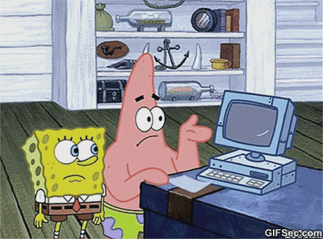

R Programming 2nd Assignments
================
Sungpil Han
2017-06-21 08:05:13

Introduction
------------

한학기 동안 고생 많으셨습니다.

두번째 과제의 제출 현황을 정리하였습니다. 성공적으로 설치된 R Packages의 목록이 나와있습니다.

### 목록 생성 방법

-   `DESCRIPTION` 파일 정보를 읽어 인용을 위한 `bibtex`파일을 생성해 주는 `knitr::write_bib()` (Xie 2017)와 `RefManageR::ReadBib()` (McLean 2016) 함수를 사용하여 나타내었습니다.

List of Submitted R Packages
----------------------------

An alphabetical order by the last name as of 2017-06-21 08:05:16

\[1\] D. Cho. *imageML: Basic image processing and Machine Learning using MNIST data (Hand written digit) for R*. R package version 0.1.0. 2017.

\[2\] S. Han. *cats: A Test of Loving Cats or Not*. R package version 0.0.1. 2017. &lt;URL: <https://github.com/shanmdphd/cats>&gt;.

\[3\] S. Han. *glasgowcoma: A Reference of Glasgow Coma Scale*. R package version 0.0.1. 2017. &lt;URL: <https://github.com/shanmdphd/glasgowcoma>&gt;.

\[4\] W. wrote it. *mDense: What the Package Does (Title Case)*. R package version 0.1.0. 2017.

\[5\] J. H. Kwon. *MyUtil: My Utilities for R*. R package version 0.1.0. 2017.

\[6\] E. Lee. *lottery: This package is for homework.....* R package version 0.0.0.9000. 2017.

\[7\] G. Lee. *ECOG: ECOG*. R package version 0.1.0. 2017.

\[8\] Y. J. Lee. *Sunscreen: Amount of sunscreen you should apply*. R package version 0.1.0. 2017.

\[9\] G. Park. *MyFunc: My function for R*. R package version 1.0.0. 2017.

\[10\] J. Park. *JHImageProcessingR: Basic Image processing In R*. R package version 0.1.0. 2017.

\[11\] G. Seo. *windex: Weight Indices*. R package version 0.1.0. 2017.

Feedback
--------

-   제출하셨으나 목록에 자신의 패키지가 보이지 않는 분은 2017-06-21 18:00 이후 <shan@acp.kr> 로 알려주세요.

### 팁

-   목록의 개발자 이름, 패키지 이름/설명/버젼 등은 `DESCRIPTION` 파일에 적힌 것을 그대로 읽어온 것입니다. 다른 사람들이 여러분의 패키지를 사용하게 되거나 인용하게 될 때 표시되는 (사람으로 비유하면 얼굴과 같은) 정보이므로 신중하게 정하는 것이 좋습니다.
-   패키지를 [CRAN](https://cran.r-project.org/web/packages/index.html) 혹은 [Github](https://github.com)나 [Bitbucket](https://bitbucket.org/) 등에 올린다면 다른 사람들이 쉽게 업데이트 할 수 있으므로 코드를 다른 사람과 공유 시 여러 장점을 갖게 됩니다.

References
----------

McLean, Mathew W. 2016. *RefManageR: Straightforward ’Bibtex’ and ’Biblatex’ Bibliography Management*. <https://CRAN.R-project.org/package=RefManageR>.

Xie, Yihui. 2017. *Knitr: A General-Purpose Package for Dynamic Report Generation in R*. <https://CRAN.R-project.org/package=knitr>.
